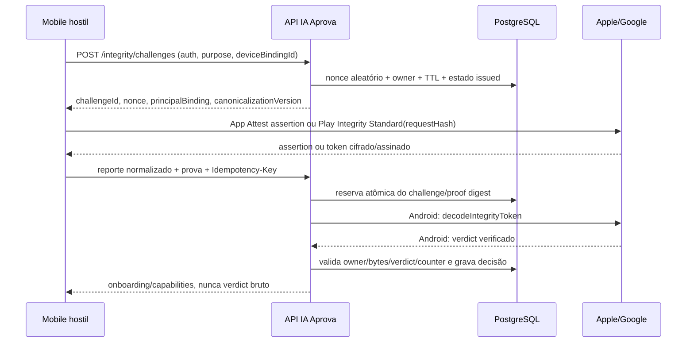

# Integridade do app e verificação server-side do sinal etário

**Data da pesquisa e verificação das fontes:** 23/08/2026

**Escopo:** Expo SDK 57, `@expo/app-integrity`, Apple App Attest, Google Play
Integrity Standard e o sinal etário já normalizado pelo IA Aprova

**Status:** desenho para implementação e homologação; não comprova código,
credenciais, build assinado, console configurado ou teste em dispositivo

**Owner proposto:** Segurança Mobile + Identidade/Privacidade

**Revisão exigida:** fiscal técnico independente e sign-off do DPO/jurídico

## 1. Decisão e limite de confiança

O estado atual `device_reported_monitoring` é correto para um valor recebido de
um processo mobile sem prova verificável pelo backend. A arquitetura-alvo
permite que o backend grave `server_verified` somente quando o reporte etário
normalizado estiver incluído numa requisição específica que tenha passado,
integralmente, pela validação server-side de App Attest ou Play Integrity.

Neste desenho, `server_verified` significa exatamente:

> o backend verificou que um reporte normalizado específico, de uma conta e
> instalação específicas, chegou numa requisição fresca e não reutilizada,
> vinculada criptograficamente a uma instância do app que satisfez a política
> de integridade da plataforma naquele momento.

Ele **não** significa que App Attest ou Play Integrity:

- comprovou data de nascimento, identidade civil ou vínculo de responsável;
- assinou diretamente a resposta produzida por Declared Age Range ou Play Age
  Signals;
- tornou impossível adulterar o valor dentro de um processo instrumentado;
- provou que o sistema operacional não está comprometido; ou
- substituiu autenticação, consentimento do responsável, política 13+, análise
  antifraude ou decisão jurídica.

O `requestHash` do Google e a assertion da Apple vinculam os bytes que o app
fornece ao mecanismo de integridade. Eles não criam uma cadeia criptográfica
direta entre a API de faixa etária e a atestação. Portanto, o banco deve também
registrar `assurance_kind=integrity_bound_report`, e a UI, os Termos e os logs
não devem chamar esse estado de “idade comprovada”. A própria Apple informa que
App Attest não identifica definitivamente todo dispositivo com sistema
comprometido; o sinal deve compor uma avaliação de risco [A1].

## 2. Objetivos de segurança e não objetivos

### Objetivos

1. Vincular conta autenticada, instalação, ação, faixa normalizada e prova de
   integridade a um desafio curto e de uso único.
2. Aceitar somente o bundle/package, assinatura, ambiente e versão esperados,
   com a decisão tomada no servidor.
3. Impedir replay, mistura de conta/dispositivo, downgrade pelo cliente,
   concorrência no contador Apple e reutilização de token Google.
4. Manter social e notificações fechados quando a prova faltar, expirar ou for
   inconsistente, sem indisponibilizar desnecessariamente o aprendizado.
5. Minimizar o dado etário: nenhuma data de nascimento, limite bruto,
   `installId` do Play Age Signals, método de verificação ou controle parental.
6. Permitir rollout em observação, teste determinístico, revogação, DSR e
   resposta a incidente sem segredos ou tokens brutos em logs.

### Não objetivos

- identificar uma pessoa ou aparelho físico de forma universal;
- usar sinal etário em marketing, publicidade, perfil comportamental, ranking
  ou analytics — os termos do Play Age Signals limitam o uso a experiências
  adequadas à idade e obrigações legais [G6];
- usar atestação como fonte única para banimento, premium, cobrança ou fraude;
- suportar prova offline: desafio, decodificação/verificação e decisão são
  necessariamente online;
- contornar ausência de contas, capabilities, quotas ou builds assinados.

## 3. Política de decisão do produto

| Estado observado | Aprendizado | Social | Notificações |
|---|---|---|---|
| `shared` + adulto + `server_verified` fresco + sem conflito | segue demais gates | pode seguir consentimento/política | pode seguir consentimento/política |
| `shared` + menor, mesmo verificado | segue age gate e responsável | bloqueado por padrão | bloqueado por padrão |
| ausente, recusado, não suportado, erro ou prova expirada | degradável conforme age gate atual | bloqueado | bloqueado |
| `verification_required` no Google | degradável; orientar Play Store | bloqueado | bloqueado |
| iOS <26 ou capability Declared Age Range ausente | ignorar fallback adulto e gravar `unsupported` | bloqueado | bloqueado |
| `shared` em conflito com autodeclaração | bloqueado até correção/reconsulta | bloqueado | bloqueado |
| integridade inválida ou replay | não banir por esse sinal isolado; limitar abuso | bloqueado | bloqueado |

Regras adicionais:

- O cliente nunca escolhe `trust_status`, `assurance_kind`, `verified_at`,
  `expires_at`, capability ou motivo da decisão.
- Versão de OS, capability e update informados pelo cliente entram nos bytes
  assinados para impedir alteração em trânsito, mas **não** são autoridade. O
  backend só eleva trust quando uma evidência criptográfica server-side da
  plataforma e uma allowlist própria corroboram a política.
- Um novo reporte não verificado nunca pode liberar recurso. Se divergir de um
  reporte anteriormente verificado, cria `pending_conflict` e fecha social,
  notificações e, conforme a política existente, aprendizado até a correção.
- Um `server_verified` não é permanente. Proposta inicial: validade de 30 dias,
  revalidação obrigatória ao trocar de conta, reinstalar, rotacionar chave,
  mudar a faixa/status, habilitar social/notificações, após incidente de
  integridade ou quando a política/version allowlist exigir. O prazo é uma
  decisão de produto/risco, não uma garantia das plataformas.
- Para o ato de habilitar social ou registrar notificações, exigir uma prova
  emitida nas últimas 24 horas; não exigir atestação em toda abertura do app.
  Essa janela precisa ser calibrada contra quota, disponibilidade e coortes.

## 4. Modelo de ameaças

| Ameaça | Ataque | Controle principal | Risco residual |
|---|---|---|---|
| app modificado | pacote recompilado envia adulto | App ID/RP ID/AAGUID/categoria Apple; `PLAY_RECOGNIZED`, pacote, certificado e versão Google | hook em app legítimo ainda pode alterar bytes antes da atestação |
| cliente/API falso | script chama a rota verificada | auth + challenge + assertion/token + binding de ação | proxy com dispositivo legítimo exige detecção de volume/risco |
| replay | reapresenta assertion/token/challenge | nonce one-use, TTL, digest da prova, contador Apple e replay protection Google | retry legítimo precisa idempotência server-side |
| troca de conta | prova de A usada por B | challenge vinculado ao UUID autenticado; chave Apple exclusiva por usuário | identificador de instalação Android não é identidade hardware |
| troca de instalação | restaura key ID ou device ID | chave Apple não sobrevive reinstalação; registro novo; instalação Android tratada como opaca | reinstalações maliciosas requerem rate/risk, não fingerprint invasivo |
| adulteração do sinal | muda `13_15` para `18_plus` | faixa/status dentro do client data/request hash; schema fechado | atestação não assina diretamente o retorno da API etária |
| downgrade | omite prova e usa rota antiga | rota antiga só produz monitoring; capability exige verified fresco | aprendizado continua de forma intencionalmente degradada |
| concorrência Apple | duas assertions usam counters próximos | `SELECT ... FOR UPDATE`, comparação e update atômicos | dispositivo pode perder resposta; retry devolve resultado idempotente |
| token Google roubado | usa token para outro payload | hash canônico inclui ação, challenge e faixa; servidor recalcula | malware no mesmo processo continua risco residual |
| resposta Google forjada | cliente inventa verdict JSON | backend chama `decodeIntegrityToken`; nunca aceita verdict do cliente | indisponibilidade/quota do Google |
| ambiente misturado | sandbox é aceito em produção | tabelas/configs e trust roots separados; AAGUID/categoria allowlist | erro operacional de configuração |
| exaustão/quota | cria challenges/warm-ups/tokens em massa | rate limits, outstanding cap, backoff, quota alert e circuit breaker | ataque distribuído com contas reais |
| vazamento | token/receipt/sinal aparece em logs | redaction, digest, retenção curta, IAM mínimo | receipt Apple obrigatório exige storage cifrado e acesso mínimo |

## 5. Componentes e trust boundaries



O TLS e o bearer token continuam obrigatórios. A atestação não substitui a
sessão Clerk nem ownership por UUID interno. O mobile e qualquer proxy são
não confiáveis; somente a API pode decodificar/verificar e atualizar trust.

## 6. Contrato de challenge

### `POST /api/v1/integrity/challenges`

Autenticado, não enfileirável offline e com limite de corpo de 4 KiB.

Request proposto:

```json
{
  "purpose": "platform_age_signal",
  "platform": "ios",
  "deviceBindingId": "2f18785b-a24d-49d0-b529-d7560645312f",
  "appleKeyId": "base64-key-id-only-for-ios"
}
```

Regras:

- `purpose` é enum server-side; nenhuma rota genérica aceita path arbitrário.
- `platform` deve corresponder ao tipo de build/sessão esperado.
- `deviceBindingId` é UUID aleatório de instalação registrado pelo backend. É
  vínculo operacional, não fingerprint ou prova de aparelho.
- `appleKeyId` é obrigatório em assertion e ausente para Android; durante a
  atestação de chave usa-se um purpose separado `apple_key_attestation`.
- O servidor vincula o challenge a `user_id`, `auth_session_hash`,
  `device_binding_id`, purpose, plataforma, ambiente e key ID; o cliente não
  recebe `user_id` interno.

Response proposto:

```json
{
  "challengeId": "ddb9b8ae-0728-4143-a813-361148711dfa",
  "nonce": "m5tRMFBHrHnp2GJDB7g93ITsWSBlrrlmvbHeNXyhI4w",
  "principalBinding": "8dYX-rfh1ZLKmoFi2esSU6uFvTlIvnfAcy8_AqQFcJk",
  "principalBindingKeyVersion": "pbk-2026-08",
  "canonicalizationVersion": "age-integrity-v1",
  "expiresAt": "2026-08-23T18:02:00.000Z"
}
```

Parâmetros propostos:

- nonce: 32 bytes de CSPRNG, Base64URL sem padding; a Apple pede challenge
  randômico e de uso único, e o Expo recomenda ao menos 16 bytes [E1][A2].
- TTL: 120 segundos pelo relógio do servidor; relógio do dispositivo é apenas
  telemetria e nunca amplia a janela.
- no máximo 3 challenges `issued` por usuário+instalação+purpose.
- challenge é single-use. O digest do nonce, não o nonce bruto, fica na base.
- `principalBinding = Base64URL(HMAC-SHA256(K_binding,
  "v1\0" + user_uuid + "\0" + auth_identity_subject))`; comparação
  constant-time. Não é credencial reutilizável e só existe para vincular os
  bytes canônicos ao principal já autenticado.
- `principalBindingKeyVersion` é emitido e persistido pelo servidor. Rotação
  passa a emitir apenas com a chave HMAC nova, mas conserva a anterior somente
  pelo maior prazo entre TTL do challenge e lease de verificação, acrescido de
  margem de 5 minutos. A verificação usa a versão gravada no challenge, nunca a
  versão que o cliente escolher nem a chave “atual” por conveniência. Em
  incidente, challenges da versão revogada são rejeitados e reemitidos.

### Máquina de estados e retry

`issued -> verifying -> consumed | rejected | expired | indeterminate`

1. Ao receber a prova, a API abre transação, bloqueia o challenge, valida
   owner/TTL/estado e cria `verification_attempt_id`, `proof_digest`,
   `Idempotency-Key`, `lease_generation=1` e status `verifying`.
2. A primeira resposta pode ser `202` com `verificationId` e `statusUrl`. O
   mesmo usuário + idempotency key + request digest recebe o mesmo `202` ou o
   resultado terminal; bytes diferentes recebem `409`.
3. Outro proof digest para challenge `verifying/consumed` recebe `409` e um
   evento de risco. Nunca volta a `issued`.
4. No Android, transactional outbox cria um job único. Cada claim incrementa
   `lease_generation`; somente `UPDATE ... WHERE lease_generation=:fence AND
   status='verifying'` pode finalizar. Worker vencido não grava verdict nem
   trust. O token fica cifrado numa coluna efêmera por no máximo 5 minutos e é
   apagado no estado terminal; não entra em Cloud Tasks, logs ou dead-letter.
5. Se o worker cair após o Google possivelmente decodificar o token e antes de
   persistir a resposta, marcar `indeterminate` e exigir challenge/token novo,
   em vez de aceitar verdict vazio ou reusar indefinidamente um token sujeito a
   replay protection. Retry automático só ocorre quando é certo que a chamada
   não foi enviada; os demais casos falham fechados.
6. Resultado final, consumo do challenge e elevação do sinal são gravados numa
   única transação protegida pelo fence. A rota
   `GET /api/v1/integrity/verifications/{verificationId}` é ownership-scoped e
   devolve somente os estados `verifying`, `verified`, `rejected`, `expired` ou
   `indeterminate`, além da decisão sanitizada.
7. Expiração/negação não apagam evidência imediatamente; seguem retenção curta.

## 7. Serialização canônica e hash do reporte

Não usar `JSON.stringify` de objeto arbitrário nem confiar na ordem do JSON
devolvido pelo Google. A serialização `age-integrity-v1` é UTF-8, ASCII nos
valores, uma linha por campo, na ordem abaixo, separada por `LF` (`0x0A`) e sem
`LF` final. Valores são validados por regex/enum e não podem conter `=`, CR ou
LF. Ausência é representada pelo literal `none`.

```text
domain=iaaprova.platform-age-signal
version=1
challenge_id=ddb9b8ae-0728-4143-a813-361148711dfa
challenge_nonce=m5tRMFBHrHnp2GJDB7g93ITsWSBlrrlmvbHeNXyhI4w
principal_binding=8dYX-rfh1ZLKmoFi2esSU6uFvTlIvnfAcy8_AqQFcJk
principal_binding_key_version=pbk-2026-08
device_binding_id=2f18785b-a24d-49d0-b529-d7560645312f
http_method=POST
http_path=/api/v1/me/platform-age-signal/verified
platform=ios
source=apple_declared_age_range
sharing_status=shared
age_band=18_plus
client_os_api_generation=ios_27_or_later
client_age_api_capability=declared_age_range_available
runtime_version=ios-2026.08-integrity.1
update_launch=embedded
update_id=embedded
proof_key_id=base64-key-id-only-for-ios
```

Restrições:

- UUIDs em lowercase; Base64URL sem padding; método/path literais; enums exatos.
- `platform -> source`: `ios -> apple_declared_age_range` e
  `android -> google_play_age_signals`.
- `shared` exige uma das quatro faixas `under_13|13_15|16_17|18_plus`;
  qualquer outro status exige `age_band=none`.
- `client_os_api_generation` e `client_age_api_capability` são claims
  não autoritativas, porém obrigatoriamente vinculadas à prova. Valores:
  `ios_pre_26|ios_26|ios_27_or_later|android|unknown` e
  `declared_age_range_available|play_age_signals_available|unsupported|unknown`.
  O servidor nunca seleciona parser/política a partir delas.
- `runtime_version`, `update_launch=embedded|ota` e `update_id` são comparados
  com o registro de releases do backend. Para embedded, `update_id=embedded`;
  para OTA, UUID lowercase allowlisted. Esses claims também não substituem a
  evidência de bundle/versionCode assinada pela plataforma.
- `proof_key_id` é o key ID Apple; no Android é `none`.
- O key ID nativo Apple é decodificado como 32 bytes e recodificado em
  Base64URL sem padding para transporte/canonicalização. O app conserva a
  string nativa separadamente apenas para chamar o módulo Expo; o servidor
  sempre compara os bytes, não variantes textuais de Base64.
- nenhuma data de nascimento, limites nativos, `installId`, método de documento,
  controles parentais ou data de aprovação entra nesses bytes.

`request_digest = Base64URL_no_padding(SHA-256(canonical_bytes))`.

- Android passa exatamente `request_digest` como `requestHash`. O Google
  recomenda hash de serialização estável de todos os parâmetros relevantes,
  limita o campo a 500 bytes e desaconselha texto sensível em claro [G2].
- iOS passa os `canonical_bytes` como string a
  `generateAssertionAsync(keyId, canonicalString)`. O backend usa exatamente os
  bytes UTF-8 recebidos, reconstrói independentemente os bytes esperados e exige
  igualdade antes de validar a assertion. A Apple define
  `clientDataHash=SHA-256(clientData)` na validação [A3].
- Uma única implementação compartilhada e vetores dourados devem existir em
  TypeScript mobile/backend. Nenhuma normalização Unicode implícita é aceita.

### 7.1 Capability etária iOS fail-closed

O `expo-age-range` documenta que, quando a API não é suportada (iOS anterior a
26 e web), `requestAgeRangeAsync` retorna `lowerBound: 18`, indistinguível de um
adulto se o chamador olhar apenas o valor [E2]. Portanto:

1. Antes da chamada, o adapter nativo classifica localmente a disponibilidade.
   Em iOS <26 ou capability ausente, não consulta ou descarta o resultado e
   normaliza para `status=unsupported`, `age_band=none`.
2. `{lowerBound:18}` só normaliza para `18_plus` quando a capability local foi
   detectada como disponível. O teste obrigatório simula iOS 25.7 + retorno
   `{lowerBound:18,upperBound:null}` e exige `unsupported`, nunca `shared`.
3. A classificação local de OS/capability entra nos bytes canônicos para
   detectar alteração em trânsito, mas o backend não confia nela para elevar.
4. O formato App Attest legado não prova se o OS é iOS 26 ou anterior. Logo,
   para **sinal etário**, uma assertion legacy válida permanece
   `device_reported_monitoring`; social/notificações ficam fechados e o
   aprendizado segue degradável. O formato com extensions assinado, introduzido
   no iOS 27, é o primeiro que esta política aceita para `server_verified`
   Apple. Alterar essa regra exige nova evidência oficial e policy version.

## 8. Apple App Attest

`@expo/app-integrity` está marcado como **alpha** e sujeito a breaking changes.
Ele expõe `isSupported`, `generateKeyAsync`, `attestKeyAsync` e
`generateAssertionAsync`; App Attest não funciona no iOS Simulator [E1]. A
integração exige development build/EAS assinado, nunca Expo Go como evidência.

### 8.1 Cadastro e atestação da chave

Fluxo por conta em cada instalação compatível:

1. Verificar `AppIntegrity.isSupported`. Dispositivo não suportado permanece em
   monitoring; não liberar social/notificações.
2. Reutilizar somente key ID já atestado e ainda ativo para a mesma conta.
3. Sem key ID, chamar `generateKeyAsync()` e persistir o identificador em
   armazenamento protegido. A chave privada fica no Secure Enclave e não pode
   ser lida pelo processo [E1][A2].
4. Pedir challenge `purpose=apple_key_attestation`, vinculado a conta,
   instalação, ambiente e key ID.
5. Chamar `attestKeyAsync(keyId, challenge.nonce)`, enviar key ID,
   `challengeId`, o mesmo nonce textual e attestation object Base64 à rota.
6. Se o erro for server unavailable, repetir com a mesma chave/challenge ainda
   válido ou obter novo challenge para a mesma chave; para outros erros,
   descartar o key ID e iniciar nova chave, com rate limit [E1][A4].

Endpoint proposto:

```text
POST /api/v1/integrity/apple/keys
Idempotency-Key: UUID
```

```json
{
  "challengeId": "uuid",
  "challengeNonce": "base64url-32-bytes",
  "deviceBindingId": "uuid",
  "keyId": "base64",
  "attestationObject": "base64"
}
```

O backend deve usar parser CBOR/ASN.1/X.509 com limites estritos de tamanho,
profundidade e contagem. Não implementar validação parcial. Validar, na ordem:

1. formato `apple-appattest`, `authData`, `x5c` e receipt;
2. cadeia leaf/intermediate até o Apple App Attestation Root CA, datas,
   algoritmo e extensões esperadas;
3. `clientDataHash=SHA-256(UTF8(challenge nonce textual))` e
   `nonce=SHA-256(authData || clientDataHash)`;
4. OID `1.2.840.113635.100.8.2` do `credCert` igual ao nonce;
5. SHA-256 da chave pública X9.62 igual ao key ID informado;
6. `RP ID = SHA-256(App ID)`, em que `App ID = App ID prefix + "." +
   CFBundleIdentifier`; o App ID prefix vem do Identifier da conta Apple e não
   deve ser presumido cegamente igual ao Team ID;
7. contador inicial exatamente `0`;
8. AAGUID do ambiente: para o fluxo development legado, a validação oficial
   documenta `appattestdevelop`; a preparação atual também denomina o ambiente
   como sandbox e documenta `appattestsandbox`. O verificador deve fixar **um**
   valor esperado por toolchain/fixture oficial homologado, nunca aceitar ambos
   como fallback. Produção exige `appattest` + sete bytes zero; nunca misturar
   ambientes [A3][A8][A9];
9. `credentialId` igual ao key ID;
10. parser/policy de authenticator data versionado conforme 8.1.2;
11. receipt obrigatório, validado e cifrado conforme 8.4.

Esses checks seguem o procedimento oficial atualizado da Apple [A3][A5]. O
servidor armazena a chave pública validada, nunca o attestation object como
credencial corrente, e impede que a mesma chave seja associada a outra conta.

#### 8.1.1 Bytes exatos de `attestKeyAsync`

No `@expo/app-integrity` do branch SDK 57, o argumento `challenge: String` é
convertido por Swift com `Data(challenge.utf8)` e então submetido a SHA-256; o
digest de 32 bytes resultante é passado ao `DCAppAttestService` como
`clientDataHash` [E3]. Portanto o contrato é:

- challenge HTTP: 32 bytes aleatórios codificados como Base64URL sem padding;
- argumento Expo: os **43 caracteres ASCII** dessa codificação, sem decodificar
  Base64URL, sem aspas JSON e sem CR/LF;
- backend: recupera o texto ecoado, valida seu SHA-256 contra `nonce_hash` e
  calcula SHA-256 dos mesmos bytes UTF-8. Hash dos 32 bytes aleatórios seria um
  valor diferente e deve falhar no vetor dourado.

Vetor dourado obrigatório mobile/backend/verificador:

```text
challenge_string = m5tRMFBHrHnp2GJDB7g93ITsWSBlrrlmvbHeNXyhI4w
utf8_length = 43
utf8_hex = 6d3574524d46424872486e7032474a4442376739334954735753426c72726c6d766248654e587968493477
sha256_hex = 6a08244b338242e0ef223579fd70b12c1fff239e430233d72d2b344a8b12f011
sha256_base64url = aggkSzOCQuDvIjV5_XCxLB__I55DAjPXLSs0SosS8BE
```

O mesmo comportamento Expo — UTF-8 da string e depois SHA-256 — vale para
`generateAssertionAsync`. Nesse caso a string é a serialização canônica inteira,
não seu `request_digest` [E3].

#### 8.1.2 Parser/policy Apple versionado

O servidor escolhe o formato somente pelos flags, comprimentos e CBOR que estão
no `authenticatorData` protegido pelo nonce/assinatura. Nunca usa `Platform.Version`,
`client_os_api_generation`, bundle version ou capability enviados pelo cliente
para escolher um parser.

| Policy | Estrutura criptográfica | Regra |
|---|---|---|
| `apple_appattest_legacy_v1` | extension-data flag desligado, campos legacy completos e nenhum byte residual | ausência de extensions é estruturalmente válida para App Attest legacy, mas não eleva sinal etário |
| `apple_appattest_extensions_v2` | extension-data flag ligado e mapa CBOR canônico integralmente consumido | `apple_validation_category_01` e `apple_bundle_version_01` são obrigatórios, tipados e allowlisted |

A Apple informa que as extensions de launch validation category e bundle
version são acrescentadas ao authenticator data de attestation **e assertion**
no iOS 27+ [A10]. Regras fail-closed:

1. Flag de extensions ligado com mapa ausente, truncado, duplicado, tipo errado,
   chave obrigatória ausente ou trailing bytes: rejeitar.
2. No v2, development aceita categoria `3`, TestFlight `2` e App Store `4` por
   allowlist de ambiente; produção pública aceita somente `4`. Bundle version
   precisa existir na release allowlist server-side.
3. Flag desligado só aceita ausência quando o tamanho/estrutura corresponder a
   fixture oficial legacy homologada. Qualquer trailing data é rejeitado. Essa
   ausência nunca é inferida de uma versão declarada pelo cliente.
4. Chave atestada como v2 nunca aceita assertion legacy posterior (downgrade).
   Chave legacy pode passar a produzir assertion v2 após upgrade do OS; a
   transição é aceita somente se RP ID, key, counter, extensions e allowlists
   forem válidos e então a policy observada é promovida atomicamente.
5. Assertions legacy continuam úteis para integridade de ações não etárias
   conforme política própria, mas não produzem `server_verified` etário. Isso
   impede que iOS <26 com o fallback adulto seja confundido com iOS 26.

### 8.2 Assertion do sinal etário

1. Consultar a faixa com `expo-age-range` e normalizá-la nos quatro valores do
   produto, preservando recusa/erro/unsupported sem inferência otimista.
2. Pedir challenge `platform_age_signal` com o key ID já atestado.
3. Construir `canonical_bytes` e chamar
   `generateAssertionAsync(keyId, canonicalString)`.
4. Enviar canonical fields, assertion, challenge ID e key ID. O servidor
   reconstrói a string; nunca usa client data não canônico como verdade.
5. Buscar a chave por key ID + usuário + instalação + ambiente. Negar IDOR.
6. Decodificar CBOR e calcular `clientDataHash=SHA-256(clientData)`;
   `nonce=SHA-256(authenticatorData || clientDataHash)`.
7. Verificar assinatura com a chave pública atestada, RP ID, challenge embutido
   e parser/policy v1 ou v2. Para elevação etária Apple, exigir v2, category e
   bundle version assinados e allowlisted.
8. Em transação, `SELECT ... FOR UPDATE` na chave e no challenge; exigir
   `assertion_counter > last_counter` (e `>0` na primeira assertion), gravar o
   novo counter, consumir challenge e elevar o reporte juntos [A3].

Um contador igual/menor é `replay_counter` e não deve ser corrigido aceitando
uma faixa maior. O retry HTTP idêntico devolve o resultado persistido pela
idempotency key; ele não revalida nem incrementa novamente.

### 8.3 Ciclo de vida

- Uma chave por conta por instalação; não reutilizar entre usuários [A2].
- Atualização normal preserva a chave. Reinstalação, migração de dispositivo e
  restauração de backup não preservam; gerar e atestar novamente [E1][A2].
- Troca de conta revoga a associação local/server-side e gera chave nova para a
  nova conta. Nunca reatribuir uma chave existente.
- Manter múltiplas chaves por usuário para múltiplos aparelhos, separadas por
  sandbox/production. Estado: `pending|active|revoked|lost|compromised`.
- Revogar server-side em exclusão de conta, troca suspeita, contador anômalo ou
  incidente. App Attest não oferece recuperação do key ID perdido.
- Rotação planejada não muda `principalBinding` de challenges já emitidos. A
  key version HMAC fica presa ao challenge; após TTL+lease+margem, a versão
  anterior é retirada. Rotação de App Attest cria novo registro/key ID e nunca
  reatribui nem sobrescreve counter da chave anterior.

### 8.4 Decisão de receipt e fraud assessment

Decisão de produção: o IA Aprova **validará e armazenará cifrado o receipt de
toda attestation Apple aceita**. Receipt ausente/inválido bloqueia o cadastro da
chave. O attestation object bruto é apagado após extração/validação; o receipt
validado fica em envelope encryption no registro da chave.

Antes de enforcement Apple, o worker server-side usará a chave DeviceCheck para
consultar/atualizar o fraud metric em modo **monitor-only**, respeitando
`not-before`, expiração e base URL do ambiente. O receipt novo substitui o
anterior atomicamente. Métrica alta nunca bloqueia sozinha; compõe investigação
de risco, pois reinstalação/restauração e rotação legítimas também elevam a
contagem [A6][A10]. Falta da chave DeviceCheck, job, validação de receipt ou
RIPD mantém o gate Apple de produção bloqueado — não converte receipt em
“opcional”. O JWT usa private key criada por Account Holder/Admin [A7].

## 9. Google Play Integrity Standard

O Expo usa o fluxo Standard no Android. Ele exige preparar o provider com o
**número** do projeto Cloud e então chamar
`requestIntegrityCheckAsync(requestHash)`. Provider expirado retorna erro e
deve ser preparado novamente [E1][G1]. Standard requests são suportadas a
partir do Android 5/API 21, mas o Age Signals e a política do produto podem
impor uma matriz mais restrita; testar em aparelho real.

### 9.1 Fluxo

1. Em cold/warm start, chamar
   `prepareIntegrityTokenProviderAsync(cloudProjectNumber)` em background.
   Google limita preparação a cinco vezes por minuto por instância e recomenda
   timeout que acomode cauda longa; não fazer warm-up em loop [G1].
2. Consultar Play Age Signals, normalizar e pedir challenge online.
3. Calcular `request_digest` dos bytes canônicos e chamar
   `requestIntegrityCheckAsync(request_digest)`.
4. Enviar o token opaco ao backend. O app nunca decodifica nem interpreta o
   verdict para elevar trust.
5. O backend reserva challenge/proof digest e usa credencial server-side para:

```text
POST https://playintegrity.googleapis.com/v1/{PACKAGE_NAME}:decodeIntegrityToken
Authorization: Bearer {short-lived OAuth token}
Content-Type: application/json

{"integrity_token":"..."}
```

O access token usa o scope
`https://www.googleapis.com/auth/playintegrity`; o service account precisa
estar no projeto Cloud vinculado ao app [G1]. Preferir Google Auth Library/ADC
e identidade anexada ao workload, sem arquivo JSON duradouro [C1].

### 9.2 Política mínima de verdict

Validar primeiro `requestDetails`, porque o Google diz que a ordem dos campos
do JSON não é garantida e que esses dados devem preceder a análise dos demais
verdicts [G3]. Produção aceita somente se todos forem verdadeiros:

| Campo | Regra server-side |
|---|---|
| `requestDetails.requestPackageName` | igual ao package configurado |
| `requestDetails.requestHash` | constant-time igual ao digest recalculado |
| `requestDetails.timestampMillis` | não futuro além de 30 s e idade <= 120 s pelo clock servidor |
| `appIntegrity.appRecognitionVerdict` | exatamente `PLAY_RECOGNIZED` |
| `appIntegrity.packageName` | package exato configurado |
| `appIntegrity.certificateSha256Digest[]` | interseção não vazia com allowlist da Play App Signing; Base64URL |
| `appIntegrity.versionCode` | allowlist de builds ainda aceitos para esse ambiente |
| `deviceIntegrity.deviceRecognitionVerdict[]` | contém `MEETS_DEVICE_INTEGRITY` |
| `accountDetails.appLicensingVerdict` | produção: `LICENSED`; teste explícito usa política/conta separada |
| `testingDetails.isTestingResponse` | nunca aceito como prova de produção |

`PLAY_RECOGNIZED` significa que app e certificado correspondem a versões
distribuídas pelo Google Play; `MEETS_DEVICE_INTEGRITY` indica aparelho genuíno
e certificado conforme os critérios da plataforma [G3]. Não aceitar
`UNEVALUATED`, campo ausente, array vazio, `UNRECOGNIZED_VERSION` ou apenas
`MEETS_BASIC_INTEGRITY`. `MEETS_STRONG_INTEGRITY` pode ser monitorado como sinal
adicional, mas não será requisito inicial para não excluir aparelhos certificados
sem medir impacto; mudança de política exige coorte e fiscal [G3].

Standard requests têm replay protection automática: decodificações repetidas
limpam ou tornam `UNEVALUATED` os verdicts. Ainda assim, o IA Aprova exige seu
challenge one-use e request digest, pois a proteção Google sozinha não vincula
owner e política interna [G1].

### 9.3 Erros, quota e indisponibilidade

- Repreparar provider em `ERR_APP_INTEGRITY_PROVIDER_INVALID`.
- Somente erro transitório recebe até três tentativas com backoff; não trocar o
  payload/challenge durante retry. Depois disso, tratar como prova ausente e
  manter social/notificações fechados, não banir [G7].
- A quota padrão oficial é 10.000 token requests e 10.000 decryptions/dia por
  projeto vinculado. Solicitar aumento antes de rollout, que pode levar até uma
  semana; criar alertas em 50/70/85% e circuit breaker [G4].
- O objetivo de 80 mil MAU torna a quota externa um gate real. Não habilitar
  enforcement antes de quota aprovada e teste de pico/retry.
- Monitorar o Play status dashboard; indisponibilidade mantém aprendizado
  degradado e não converte monitoring em verified [G5].

## 10. Rota verificada e respostas

### `POST /api/v1/me/platform-age-signal/verified`

Headers: bearer, `Idempotency-Key: UUID`, `Content-Type: application/json`.
Limites propostos: 32 KiB iOS e 64 KiB Android, confirmados contra tokens reais.

Request iOS:

```json
{
  "challengeId": "uuid",
  "challengeNonce": "base64url-32-bytes",
  "deviceBindingId": "uuid",
  "canonicalizationVersion": "age-integrity-v1",
  "clientContext": {
    "osApiGeneration": "ios_27_or_later",
    "ageApiCapability": "declared_age_range_available",
    "runtimeVersion": "ios-2026.08-integrity.1",
    "updateLaunch": "embedded",
    "updateId": "embedded"
  },
  "signal": {
    "platform": "ios",
    "status": "shared",
    "ageBand": "18_plus"
  },
  "proof": {
    "provider": "apple_app_attest",
    "keyId": "base64",
    "assertion": "base64"
  }
}
```

`clientContext` é obrigatório e assinado, mas não autoritativo. O backend
compara runtime/update à sua release registry e deriva a policy Apple do
authenticator data. `osApiGeneration` nunca libera capability por si só.

Request Android troca `proof` por:

```json
{
  "provider": "google_play_integrity_standard",
  "integrityToken": "opaque-token"
}
```

Response `200`, sem counter/verdict/token/hash interno:

```json
{
  "platformAgeSignal": {
    "platform": "ios",
    "source": "apple_declared_age_range",
    "status": "shared",
    "ageBand": "18_plus",
    "trust": "server_verified",
    "assuranceKind": "integrity_bound_report",
    "verifiedAt": "2026-08-23T18:00:23.450Z",
    "expiresAt": "2026-09-22T18:00:23.450Z"
  },
  "learning": {"eligible": true, "reason": "eligible"},
  "social": {"eligible": false, "reason": "social_permission_required"},
  "notifications": {"eligible": false, "reason": "notifications_permission_required"}
}
```

Enquanto o worker Android possui o lease, responder `202`:

```json
{
  "verificationId": "5c59152b-9134-4d4d-a046-24928fb13e6f",
  "status": "verifying",
  "statusUrl": "/api/v1/integrity/verifications/5c59152b-9134-4d4d-a046-24928fb13e6f",
  "retryAfterSeconds": 2
}
```

Poll autenticado retorna o mesmo `202` ou o resultado terminal. Ele nunca
recebe token, fence, número do counter ou verdict bruto.

Erros:

- `401`: sessão inválida; `403`: owner/key/build/verdict não autorizado;
- `409`: challenge consumido, idempotency conflict, conta/chave conflitante ou
  counter replay; `410`: challenge expirado;
- `422`: canonicalização, signal shape ou proof inválido;
- `429`: rate/quota local; `503`: provedor/decoder indisponível.

Erro nunca revela qual certificado, counter esperado, verdict parcial ou
detalhe criptográfico falhou. O `requestId` permite suporte; reason codes
internos ficam em auditoria restrita.

## 11. Persistência proposta

Nenhuma tabela abaixo é implementação atual; exige migration expand/contract,
contratos e fiscal separado.

### `integrity_challenges`

| Campo | Observação |
|---|---|
| `id`, `user_id`, `device_binding_id` | PK/ownership; cascade conforme DSR |
| `auth_session_hash` | HMAC/digest, nunca bearer token |
| `purpose`, `platform`, `environment` | enums fechados |
| `apple_key_id` | nullable; FK lógica por owner/environment |
| `nonce_hash`, `principal_binding_hash`, `principal_binding_key_version` | SHA-256/HMAC versionado; nonce bruto não persiste |
| `canonicalization_version` | somente versões allowlisted |
| `status` | issued/verifying/consumed/rejected/expired/indeterminate |
| `proof_digest`, `request_digest`, `idempotency_key` | unique por owner/operação |
| `verification_attempt_id`, `lease_generation`, `lease_owner`, `lease_expires_at` | job/fencing; owner do lease não é usuário |
| `proof_ciphertext`, `proof_key_version`, `proof_delete_at` | somente token Google efêmero, KMS e TTL <=5 min |
| `issued_at`, `expires_at`, `reserved_at`, `consumed_at` | clock do servidor |
| `failure_code`, `attempt_count` | enum interno, sem payload bruto |

Índices únicos parciais evitam múltipla reserva/consumo; queries mutáveis usam
row lock. Claim/reclaim incrementa `lease_generation`; toda conclusão compara o
fence. Job expira `issued/verifying` abandonados, apaga ciphertext e nunca
recoloca challenge em `issued`.

### `app_integrity_keys` (Apple)

| Campo | Observação |
|---|---|
| `id`, `user_id`, `device_binding_id` | uma conta/instalação; nunca reatribuir |
| `key_id`, `key_id_hash` | lookup + detecção; key ID não é segredo |
| `public_key_spki` | chave pública validada |
| `receipt_ciphertext`, `receipt_key_version` | obrigatório em chave aceita, KMS envelope; nunca log |
| `app_id_prefix`, `bundle_id`, `bundle_version` | esperado/verificado |
| `aaguid_environment`, `validation_category` | dev/testflight/appstore segregados |
| `last_assertion_counter` | bigint/inteiro sem sinal, update atômico |
| `status`, `attested_at`, `last_asserted_at`, `revoked_at` | lifecycle/auditoria |

Unique `(environment,key_id_hash)` e regra de banco/serviço que impede outra
conta. Chave pública e receipt são dados de segurança restritos.

### `integrity_verifications`

Persistir em longo prazo somente: event ID, owner/device, provider, purpose, ambiente,
request/proof/token digest, app/build decision, device decision resumida,
outcome/reason code, latency, issued/verified timestamps e testing flag. Não
persistir token Google, assertion, attestation object, cadeia completa ou
payload etário bruto após o job terminal. A exceção temporária é o token Google
cifrado e com TTL curto descrito em `integrity_challenges`.

### Extensão de `platform_age_signals`

Adicionar `verification_id`, `assurance_kind`, `verified_at`, `expires_at`,
`verified_build`, `verification_policy_version` e `pending_conflict`. Somente o
serviço interno de verificação pode gravar `server_verified`. A rota pública
continua incapaz de elevar trust e deve criar evento de conflito quando houver
mudança relevante, em vez de ocultar um sinal verificado anterior.

## 12. Rate limits e abuso

Valores iniciais propostos, todos por usuário + instalação + IP/ASN conforme
camada, com `Retry-After` e exceção operacional auditada:

| Operação | Limite |
|---|---|
| emitir challenge etário | 10/10 min, 30/dia; máx. 3 outstanding |
| cadastrar chave Apple | 3/dia/conta, 5/dia/instalação, 20/dia/IP |
| verificar reporte | 5/10 min, 20/dia/conta/instalação |
| falhas criptográficas/verdict | 5/h fecha nova emissão por 1 h |
| Google provider warm-up | app limita a <=5/min, ideal 1 por ciclo útil |

Controles complementares: limite de tamanho antes do parse, timeout externo,
circuit breaker, fila limitada, cache **somente** de config/allowlist — nunca de
verdict — e métricas de key churn, token fan-out, replay e contas por instalação.
IP, ASN, integridade e reinstalação são sinais; nenhum causa banimento sozinho.

## 13. Minimização, retenção e DSR

### Coleta permitida

- faixa normalizada, status, plataforma, source e timestamps server-side;
- IDs internos pseudônimos de conta/instalação;
- chaves públicas Apple, counter, ambiente e build;
- digests irreversíveis de nonce/proof/token e outcome resumido.

### Coleta proibida neste fluxo

- data de nascimento ou nome real;
- limites etários nativos brutos após normalização;
- `installId` do Play Age Signals, controles parentais, método de verificação,
  documento/pagamento/selfie ou datas de aprovação;
- token Google, assertion/attestation Apple ou bearer em logs/APM;
- uso do sinal para marketing, recomendação comercial ou analytics geral.

Retenção proposta, sujeita a RIPD/DPO:

| Dado | Prazo operacional proposto |
|---|---|
| challenges/rejeições detalhadas | 24 h; depois só agregado sem usuário |
| verification events minimizados | 90 dias; extensão apenas para incidente/base aprovada |
| key pública/counter Apple | enquanto ativa; revogada por 90 dias contra replay |
| receipt Apple cifrado | enquanto fraud assessment necessário; apagar em até 90 dias da revogação |
| sinal etário corrente | vida da conta/obrigação; apagar/anonymizar no DSR conforme base legal |
| métricas agregadas | sem faixa individual/ID; retenção operacional aprovada |

DSR deve exportar em linguagem compreensível faixa/status/trust, datas,
plataforma e decisões, sem entregar material que facilite replay. Exclusão
revoga chaves e challenges, remove vínculo pessoal e agenda deleção em
backups/terceiros segundo o runbook. Legal hold/fraude exige base, escopo, prazo
e acesso separados; não conservar tudo “por segurança”.

O Play Age Signals declara que seu dado só pode ser usado para adequação etária
e compliance, não publicidade, marketing, profiling ou analytics [G6]. A
telemetria de integridade deve ficar separada e nunca segmentar conteúdo/growth
por faixa além dos gates legais do produto.

## 14. Segredos, IAM e configuração server-side

### Apple

- App Attest root certificate é público e deve ser pinado/versionado por fonte
  Apple, com processo de atualização; não é segredo.
- Verificação local de attestation/assertion usa chave pública recebida e não
  exige segredo Apple.
- Fraud assessment definido para produção exige private key com **DeviceCheck**
  habilitado, Key ID e Team ID para JWT. Só Account Holder/Admin cria e baixa a
  `.p8` uma vez; armazenar no Secret Manager cifrado, negar acesso mobile/CI genérico,
  auditar uso e rotacionar/revogar em incidente [A6][A7].
- Config server-side imutável por ambiente: App ID prefix, Team ID informativo,
  bundle ID, RP ID hash, AAGUID, validation categories e bundle version
  allowlist. Nada vem como autoridade do cliente.

### Google

- Projeto GCP dedicado/vinculado ao app; Play Integrity API habilitada.
- Service account de runtime dedicado para decodificação. Em Cloud Run/GCP,
  anexar a identidade ao workload e usar ADC/short-lived token; não criar JSON
  key. Google recomenda evitar service-account keys quando possível [C1].
- Scope exato: `https://www.googleapis.com/auth/playintegrity`; endpoint e
  package fixos na configuração. Staging e produção usam projetos/service
  accounts separados quando possível.
- Config server-side: project number, package, Play App Signing certificate
  SHA-256 Base64URL, versionCode allowlist e policy version. O project number é
  público no app; credencial do service account nunca é.
- IAM de deploy não deve permitir que o app/API leia outros segredos. Acesso ao
  Apple `.p8` fica só no worker/componente isolado de fraud assessment.

Logs usam allowlist. Redigir headers, tokens, attestation/assertion, receipts,
challenges e key material. Secret scanning e teste com canário são gate.

## 15. Configuração externa obrigatória

### 15.1 Apple Developer / App Store Connect

Responsável legal/Account Holder ou Admin deve fornecer e registrar:

1. organização ativa no Apple Developer Program;
2. App ID explícito do IA Aprova e `CFBundleIdentifier` final;
3. App ID prefix real obtido em Certificates, Identifiers & Profiles e Team ID;
4. capability **App Attest** habilitada no Identifier/target; Xcode adiciona o
   entitlement `com.apple.developer.devicecheck.appattest-environment` [E1][A8];
5. provisioning profiles regenerados após a capability;
6. build development com environment `development` para sandbox; TestFlight e
   App Store sempre operam em produção, independentemente do entitlement [A8];
7. bundle versions/categorias esperadas na allowlist do backend;
8. para o fraud assessment de produção: Keys > `+` > chave com DeviceCheck,
   download único `.p8`, Key ID e Team ID; custodiante e rotação documentados.

Credenciais/valores externos que bloqueiam implementação completa:

- `APPLE_TEAM_ID`, `APPLE_APP_ID_PREFIX`, `APPLE_BUNDLE_ID`;
- profiles assinados com App Attest e declared age range;
- `APPLE_DEVICECHECK_KEY_ID` e `.p8` no Secret Manager, nunca repo;
- dispositivos físicos Apple compatíveis e contas de teste apropriadas.

### 15.2 Google Play Console / Google Cloud

1. Conta organizacional verificada e app criado com package final.
2. Play App Signing habilitado; registrar SHA-256 do certificado usado pelo
   Google Play, não apenas certificado local/upload.
3. GCP: criar/selecionar projeto; APIs & Services > Enable APIs and Services >
   habilitar **Play Integrity API**.
4. Play Console > app > **Protected with Play** > Play Integrity API > Get
   started/Manage > **Link Cloud project**. O vínculo habilita configuração
   adicional e pedido de quota [G4].
5. Criar service account no projeto vinculado e anexá-lo ao workload backend;
   validar `decodeIntegrityToken` com OAuth scope playintegrity. Não embarcar
   JSON key.
6. Registrar o **Cloud project number** numérico para
   `prepareIntegrityTokenProviderAsync`; separar config de staging/prod.
7. Protected with Play > Play Integrity API > Manage > Testing: cadastrar
   e-mails de testadores e respostas/erros simulados. Respostas de teste contêm
   `testingDetails.isTestingResponse=true` e nunca elevam produção [G5].
8. Publicar build assinado em Internal testing/closed track e adquirir o app
   pelo Play para obter `PLAY_RECOGNIZED`/`LICENSED` reais.
9. Solicitar aumento de quota acima de 10 mil/dia para token e decrypt, aguardar
   aprovação e configurar quota alerts antes de enforcement [G4].
10. Play Console > Protected with Play > Monitor: acompanhar versões,
    certificados, erros e verdicts durante shadow rollout [G5].

Credenciais/valores externos bloqueadores:

- `GOOGLE_CLOUD_PROJECT_ID` e `GOOGLE_CLOUD_PROJECT_NUMBER`;
- `ANDROID_PACKAGE_NAME` final;
- SHA-256 Base64URL da Play App Signing e versionCodes aprovados;
- runtime service account/ADC com acesso ao projeto vinculado;
- quota aprovada e test accounts/tracks configurados.

### 15.3 Expo/EAS

1. Validar a versão exata compatível pelo `npx expo install
   @expo/app-integrity`; o módulo estava alpha em 23/08/2026 [E1].
2. Adicionar capabilities/entitlements via config plugin/prebuild e comparar o
   signed entitlements do IPA, não apenas `app.json`.
3. Usar development client e EAS builds assinados; Simulator não testa App
   Attest e Expo Go não é evidência de capability/provisioning.
4. Fixar versão testada e revisar changelog em toda atualização Expo, pois o
   contrato alpha pode quebrar.

### 15.4 Política de Expo Updates/OTA

EAS Update pode trocar JavaScript sem trocar o bundle version/versionCode que a
plataforma atesta. Logo, App Attest/Play Integrity não provam por si sós qual
update JavaScript está executando. Política de produção:

1. Configurar end-to-end code signing do Expo Updates; private key fica offline
   ou em KMS/release job isolado e o certificado público fica embutido no app.
   Update sem assinatura válida não executa [E5]. Se o plano EAS necessário não
   estiver contratado, OTA fica desabilitado no build público.
2. Usar `runtimeVersion` por `fingerprint` ou valor manual imutável equivalente
   e gerar novo runtime/build sempre que SDK, módulo nativo, entitlement,
   capability, certificado de update ou código nativo mudar. Expo documenta que
   runtime version delimita compatibilidade native/update [E4][E5].
3. Backend mantém registry aprovado de `(platform, store build,
   runtimeVersion, updateId, update-signing-key-id, securityPolicyVersion)`.
   `runtimeVersion/updateId/updateLaunch` entram nos bytes canônicos, mas
   continuam claims do cliente; somente a registry e a evidência de build da
   plataforma concedem autoridade. Update ID desconhecido/revogado não eleva.
4. Normalização etária, serialização canônica, escolha de parser, trust policy,
   verificação criptográfica e gates de social/notificação **não podem mudar por
   OTA isolado**. Exigem backend compatível primeiro, novo binary de loja,
   runtime version nova, vetores/gates e rollout independente.
5. OTA fica restrito a UI/copy/correções não relacionadas a segurança, é
   publicado gradualmente, testado em preview com o mesmo runtime e allowlisted
   no backend antes da promoção. Rollback revoga `updateId` no servidor.
6. `Updates.updateId`, `runtimeVersion` e `isEmbeddedLaunch` são telemetria
   vinculada à assertion, não prova resistente a hook. Essa limitação permanece
   no risk model; nenhum OTA amplia assurance do App Attest.

## 16. Ambientes e matriz de dispositivos

Ambientes não compartilham challenges, keys, receipts, service accounts,
allowlists ou trust. Um header/config do cliente não escolhe ambiente; o
backend/deploy determina.

| Plataforma/caso | Evidência esperada | Resultado esperado |
|---|---|---|
| iOS Simulator | App Attest não suportado | monitoring; social/notif fechados; learning degradado |
| iOS <26 + fallback `{lowerBound:18}` | capability indisponível | `unsupported`, nunca adulto/verified |
| iPhone compatível, dev build sandbox | AAGUID sandbox/development, category 3 | aceito somente em staging |
| iOS 26 ou formato App Attest legacy | sem extensions assinadas | App Attest pode ser válido, mas idade fica monitoring |
| TestFlight iOS 27+ | extensions v2, production, category 2 | aceito em preprod, nunca como App Store category 4 |
| App Store iOS 27+ | extensions v2, category 4, bundle version allowlisted | elegível para produção |
| iPhone `isSupported=false` | sem chave | monitoring/fail-closed sensível |
| update normal iOS | mesma chave, counter cresce | assertion válida |
| reinstalação/restore/migração iOS | key ID perdido/inválido | novo cadastro; anterior revoked/lost |
| troca de conta iOS | chave anterior ligada a outra conta | revogar/gerar nova; nunca reatribuir |
| assertion concorrente/replay | counter fora de ordem/igual | uma vence; demais 409/idempotent replay |
| Android internal track adquirido pelo Play | recognized + licensed + device | staging aceito; testing flag separado |
| Android App Store production | package/cert/version allowlist | elegível para produção |
| sideload/tampered | unlicensed/unrecognized | negar elevação; oferecer remediação segura |
| aparelho certificado | `MEETS_DEVICE_INTEGRITY` | pode elevar se todos os checks passam |
| root/hook/emulador não certificado | verdict vazio/insuficiente | negar elevação |
| Play Console test response | `isTestingResponse=true` | somente test tenant/env |
| provider expirado | erro provider invalid | repreparar uma vez, backoff |
| Play/Google sem rede/quota | erro/timeout | learning degradado; sensíveis fechados |
| Android reinstalado/troca de conta | novo device binding operacional | novo challenge; não inferir aparelho físico |
| versão antiga removida da allowlist | verdict pode ser íntegro, build não | pedir atualização; não elevar |
| OTA não assinado/update ID ausente ou revogado | sem correspondência na release registry | não elevar; rollback/update seguro |

Em ambos: testar `under_13`, `13_15`, `16_17`, `18_plus`, recusa, status
ausente, `verification_required`, ambiguidade, conflito, conta sem loja,
foreground/background, retry, clock do aparelho adulterado e DSR.

## 17. Rollout e observabilidade

### Métricas sem dado etário individual

- challenge issued/expired/consumed/replayed por platform/build/environment;
- attestation/key creation success, unsupported, error e key churn;
- assertion counter replay/gap e associação cruzada negada;
- Play prepare/token/decode latency, status, quota e verdict categories;
- proporção recognized/device/licensed e testing flag;
- transição monitoring -> verified, expiração e conflito, apenas agregadas;
- efeito de bloqueio em social/notificações e fallback de aprendizado;
- alertas de aumento de `UNEVALUATED`, certificados desconhecidos ou versão
  rejeitada após release.

Não usar faixa etária em dashboards de growth. Dimensões pequenas devem ser
suprimidas para evitar reidentificação.

### Fases

0. **Lab:** fixtures oficiais/negativos, staging, dispositivos reais, nenhuma
   mudança de trust.
1. **Shadow 1%:** verifica e registra outcome, mas banco continua monitoring.
2. **Shadow 10/50/100%:** mede suporte, falso negativo, quota, latência e
   acessibilidade; botão de correção/suporte pronto.
3. **Write verified:** grava trust, ainda sem novo bloqueio além da política já
   restritiva; comparar capacidades.
4. **Enforcement 5/25/100%:** somente social/notificações e atos de habilitação;
   aprendizagem permanece degradável.

Cada fase exige 7 dias estáveis, quota <70%, erro não transitório <1%, ausência
de P0/P1, DPO/jurídico e fiscal. Kill switch server-side separado por plataforma
desliga enforcement, **não** transforma falha em verified nem abre social.

Alertas P0: produção aceitou sandbox/testing, pacote/bundle/cert divergente,
mesmo key ID em contas distintas, counter regrediu aceito, token/proof apareceu
em log ou rota pública escreveu `server_verified`.

## 18. Testes e gates de implementação

### Unitários/contrato

- vetores dourados iguais mobile/backend para canonical bytes e SHA-256;
- vetor de attestation challenge prova que Expo usa SHA-256 dos 43 bytes UTF-8
  da string Base64URL, não dos 32 bytes decodificados;
- permutação JSON, Unicode, CR/LF, padding Base64, UUID uppercase e enum extra;
- shape `shared`/ageBand e mapping plataforma/source;
- iOS 25.7 + retorno mock `{lowerBound:18,upperBound:null}` produz
  `status=unsupported`, `ageBand=null`; nunca `18_plus`;
- OS/capability/runtime/update alterados mudam os bytes/hash, mas nenhum campo de
  trust/score/capability enviado pelo cliente decide autoridade;
- OpenAPI não expõe verdict, counter, receipt, nonce hash ou public key.

### Apple

- Attestation Object Validation Guide/fixture oficial passa; bit flip em cada
  componente falha [A5].
- cadeia/root, OID nonce, RP ID, key ID, credentialId, AAGUID, counter 0,
  validation category e bundle version negativos independentes;
- parser legacy: ED flag desligado, fixture/tamanho exato e zero trailing bytes;
  permanece monitoring para idade;
- parser v2: ED flag ligado exige mapa CBOR e as duas extensions; missing,
  duplicate, wrong type, truncation e trailing bytes falham;
- downgrade v2->legacy falha; upgrade de chave legacy por assertion v2 só passa
  com assinatura, RP ID, counter, category, bundle/version e release allowlist;
- assertion signature/clientData/challenge/RP ID/counter/category/version;
- 20+ assertions concorrentes: apenas counters monotônicos e uma atualização
  por challenge; retry idêntico é estável;
- reinstall, account switch, lost key ID, unsupported, sandbox/TestFlight/App
  Store e server unavailable.

### Google

- `requestPackageName`, requestHash e freshness antes dos verdicts;
- recognized/unrecognized/unevaluated, licensed/unlicensed/unevaluated,
  device/basic/strong/empty, cert rotation e version allowlist;
- token repetido, challenge repetido, token de outro payload/conta/package;
- todas as respostas/erros configuráveis do Play Console; production rejeita
  `isTestingResponse=true`;
- provider expiration, três retries, timeout, 429/quota e Google outage.
- dois requests iguais enquanto `verifying` recebem o mesmo verification ID;
  lease antigo não finaliza após reclaim/fence; crash após decode fica
  `indeterminate` e requer prova nova.

### Privacidade/operação

- captura de logs/APM prova ausência de token/assertion/attestation/receipt,
  bearer, nonce e faixa bruta;
- export/delete/revocation e retenção automatizada;
- IAM negativo: mobile/CI genérico não lê secrets; API não acessa secret Apple,
  reservado ao worker/componente de fraud assessment;
- device lab com VoiceOver/TalkBack, mensagens acionáveis e nenhum loop de
  prompt; recusa continua permitindo o aprendizado autorizado.
- OTA assinado/allowlisted passa em UI não sensível; assinatura inválida,
  runtime incompatível, update desconhecido/revogado e tentativa de alterar
  canonicalizer/policy falham fechados.

Gates de release: build IPA/AAB assinado inspecionado, consoles e quotas reais,
staging isolado, restore/reinstall, observação 100%, pentest autorizado,
threat-model atualizado e parecer independente. Este documento não aprova
nenhum desses gates.

## 19. Ordem implementável

1. DPO/jurídico aprova semântica `integrity_bound_report`, uso e retenção.
2. Responsável legal entrega IDs/capabilities/profiles/projetos/tracks/quotas.
3. Implementar canonicalizer e fixtures douradas compartilhadas.
4. Criar schema expand-only de challenges, keys, verification events e campos
   de evidência, sem mudar a rota pública.
5. Implementar Apple verifier completo contra fixture oficial e revisão crypto.
6. Implementar Google decode via ADC, allowlists e Play test responses.
7. Adicionar endpoints/idempotência/locks/rate limits e testes PostgreSQL reais.
8. Integrar Expo alpha em builds assinados, com paths de erro e reinstalação.
9. Configurar Expo Updates assinado/registry ou desabilitar OTA em produção.
10. Executar device matrix, privacy log capture e load/quota test.
11. Rodar shadow rollout; somente depois habilitar write/enforcement gradual.

## 20. Riscos e bloqueadores remanescentes

| ID | Risco/bloqueador | Tratamento/gate |
|---|---|---|
| INT-AGE-001 | AppIntegrity Expo é alpha e pode quebrar | fixar versão, native build, changelog e contract tests |
| INT-AGE-002 | atestação não comprova DOB nem assina diretamente AgeRange | semântica restrita, guardian/auth/política continuam obrigatórios |
| INT-AGE-003 | falta de App ID/capability/profiles/devices Apple | responsável legal fornece; sem atalho |
| INT-AGE-004 | falta de project link, service account, cert e track Google | console owner fornece; staging real obrigatório |
| INT-AGE-005 | quota padrão 10 mil/dia abaixo do crescimento previsto | aumento aprovado antes de rollout/enforcement |
| INT-AGE-006 | App Attest unsupported e outages legítimos | learning degradado, sensíveis fechados, suporte/kill switch seguro |
| INT-AGE-007 | parser CBOR/ASN.1 incorreto | fixture Apple, biblioteca mantida, fuzz e revisão crypto independente |
| INT-AGE-008 | rota pública atual preserva verified antigo diante de novo conflito | evento/version/freshness e `pending_conflict` antes de enforcement |
| INT-AGE-009 | reinstalação/conta compartilhada cria churn de chave | lifecycle/rate/risk e recuperação sem reatribuição |
| INT-AGE-010 | retenção/uso viola termos do Age Signals | DPO, separação de telemetry, sem marketing/profiling/analytics |
| INT-AGE-011 | documentação Apple atual usa nomes AAGUID development/sandbox distintos | fixture real por Xcode/iOS alvo e allowlist única por ambiente antes de enforcement |
| INT-AGE-012 | App Attest legacy não prova iOS 26 versus pre-26 | não elevar idade no legacy; learning degradado até formato v2/evidência oficial |
| INT-AGE-013 | worker perde resultado Google após decode | fence + indeterminate + token/challenge novo; nunca aceitar verdict limpo/ausente |
| INT-AGE-014 | OTA troca JS sem mudar build atestado | code signing, runtime/update registry e proibição de mudança security-sensitive via OTA |

## 21. Fontes oficiais

Todas as URLs abaixo foram abertas ou localizadas em domínio oficial e
verificadas em 23/08/2026. Datas “última atualização” são as exibidas pela
própria fonte quando disponíveis.

### Expo

- **[E1]** [Expo — AppIntegrity (latest; alpha)](https://docs.expo.dev/versions/latest/sdk/app-integrity/): API, instalação, Standard request, App Attest, suporte, chaves, retry e reinstalação. Acesso em 23/08/2026.
- **[E2]** [Expo — AgeRange (latest)](https://docs.expo.dev/versions/latest/sdk/age-range/): normalização de respostas, status, consentimento e limites das APIs nativas. Acesso em 23/08/2026.
- **[E3]** [Expo SDK 57 source — IntegrityModule.swift](https://github.com/expo/expo/blob/sdk-57/packages/expo-app-integrity/ios/IntegrityModule.swift): conversão exata `Data(challenge.utf8)` + SHA-256 para attestation/assertion. Acesso em 23/08/2026.
- **[E4]** [Expo — Runtime versions and updates](https://docs.expo.dev/eas-update/runtime-versions/): compatibilidade de update com runtime nativo e políticas de runtime. Última atualização exibida: 03/07/2026.
- **[E5]** [Expo — End-to-end code signing with EAS Update](https://docs.expo.dev/eas-update/code-signing/): assinatura, certificado embutido, chave privada e rotação/runtime. Última atualização exibida: 21/07/2026.

### Apple

- **[A1]** [Apple — DeviceCheck](https://developer.apple.com/documentation/devicecheck): limites de App Attest e uso como parte de avaliação de risco. Acesso em 23/08/2026.
- **[A2]** [Apple — Establishing your app's integrity](https://developer.apple.com/documentation/devicecheck/establishing-your-app-s-integrity): disponibilidade, chave por usuário/dispositivo, challenge, assertions e reinstalação. Acesso em 23/08/2026.
- **[A3]** [Apple — Validating apps that connect to your server](https://developer.apple.com/documentation/devicecheck/validating-apps-that-connect-to-your-server): validação de attestation/assertion, RP ID, nonce, AAGUID, key ID, categories, bundle version e counter. Acesso em 23/08/2026.
- **[A4]** [Apple — attestKey](https://developer.apple.com/documentation/devicecheck/dcappattestservice/attestkey%28_%3Aclientdatahash%3Acompletionhandler%3A%29): retry seguro em indisponibilidade do servidor. Acesso em 23/08/2026.
- **[A5]** [Apple — Attestation Object Validation Guide](https://developer.apple.com/documentation/devicecheck/attestation-object-validation-guide): fixture e resultados esperados do verificador. Acesso em 23/08/2026.
- **[A6]** [Apple — Assessing fraud risk](https://developer.apple.com/documentation/devicecheck/assessing-fraud-risk): receipt, ambientes, métrica e validação. Acesso em 23/08/2026.
- **[A7]** [Apple — Create a DeviceCheck private key](https://developer.apple.com/help/account/capabilities/create-a-devicecheck-private-key/): role, criação e rotação da chave. Acesso em 23/08/2026.
- **[A8]** [Apple — App Attest Environment entitlement](https://developer.apple.com/documentation/bundleresources/entitlements/com.apple.developer.devicecheck.appattest-environment): development/production e comportamento de distribuição. Acesso em 23/08/2026.
- **[A9]** [Apple — Preparing to use the App Attest service](https://developer.apple.com/documentation/devicecheck/preparing-to-use-the-app-attest-service): sandbox, AAGUID, segregação de ambiente, ramp-up e throttling. Acesso em 23/08/2026.
- **[A10]** [Apple WWDC26 — Secure your apps with App Attest](https://developer.apple.com/videos/play/wwdc2026/201/): extensions no authenticator data de attestation/assertion no iOS 27+, lifecycle, counters, receipts e fraud metric. Acesso em 23/08/2026.

### Google

- **[G1]** [Google — Make a standard API request](https://developer.android.com/google/play/integrity/standard): warm-up, token, decode server-side e replay protection. Última atualização exibida: 01/06/2026 UTC.
- **[G2]** [Google — Protect requests with requestHash](https://developer.android.com/google/play/integrity/standard#protect-requests): serialização estável, SHA-256, limite e comparação server-side. Última atualização exibida: 01/06/2026 UTC.
- **[G3]** [Google — Integrity verdicts](https://developer.android.com/google/play/integrity/verdicts): request, app, certificado, versão, device e licensing verdicts. Última atualização exibida: 01/05/2026 UTC.
- **[G4]** [Google — Play Integrity setup](https://developer.android.com/google/play/integrity/setup): enable/link do projeto, quotas e responses. Última atualização exibida: 14/08/2026 UTC.
- **[G5]** [Google — Additional tools and support](https://developer.android.com/google/play/integrity/additional-tools): testing responses, monitoring, status e troubleshooting. Última atualização exibida: 01/07/2026 UTC.
- **[G6]** [Google — Play Age Signals overview](https://developer.android.com/google/play/age-signals/overview): finalidade permitida, termos e data safety. Última atualização exibida: 20/07/2026 UTC.
- **[G7]** [Google — Play Integrity error codes](https://developer.android.com/google/play/integrity/error-codes): classificação de erros e backoff. Acesso em 23/08/2026.

### Google Cloud

- **[C1]** [Google Cloud — Best practices for service accounts](https://cloud.google.com/iam/docs/best-practices-service-accounts): preferir identidade anexada/workload federation e evitar chaves persistentes. Acesso em 23/08/2026.
