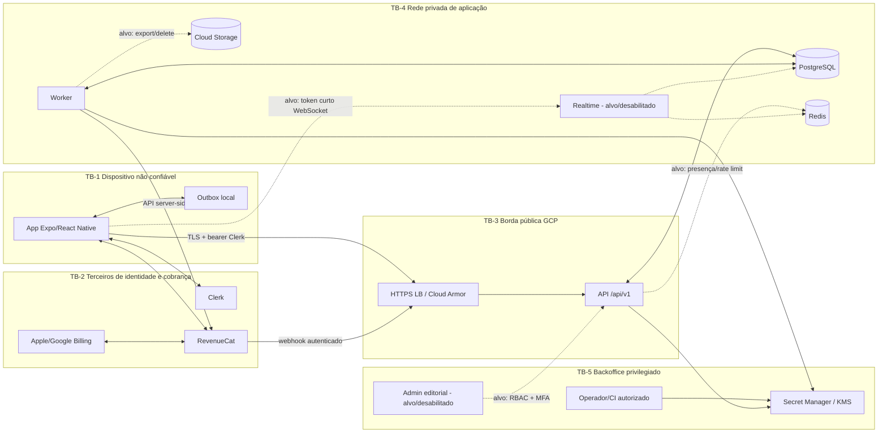

# Modelo de ameaças e fluxos de dados

**Método:** STRIDE por componente, fluxo e trust boundary  
**Escopo:** aplicativo Expo/React Native, Clerk, API, worker, PostgreSQL,
Redis, RevenueCat/lojas, social/realtime, admin, Cloud Storage e operação GCP  
**Status:** desenho revisável; não comprova implementação nem teste

Legenda usada nas tabelas: **S** — Spoofing (falsificação de identidade),
**T** — Tampering (adulteração), **R** — Repudiation (repúdio), **I** —
Information Disclosure (divulgação de informação), **D** — Denial of
Service (negação de serviço) e **E** — Elevation of Privilege (elevação
de privilégio).

## 1. Premissas, ativos e objetivos

O cliente é ambiente hostil: pode ser instrumentado, recompilado, executado em
dispositivo comprometido e ter tráfego observado pelo próprio usuário. O
servidor é a única autoridade para gabarito, correção, score, XP, domínio,
premium e resultado competitivo. App Attest e Play Integrity são sinais de
risco, nunca identidade ou prova isolada de legitimidade.

Ativos prioritários:

| Ativo | Classificação | Objetivo |
|---|---|---|
| Token/sessão Clerk, vínculo `subject -> UUID` | restrito | impedir tomada ou mistura de contas |
| Faixa etária, responsável, consentimentos e DSR | pessoal/restrito | integridade, minimização e rastreabilidade |
| Tentativas, progresso e revisão | pessoal | confidencialidade e primeira resposta imutável |
| Gabaritos, soluções e banco editorial | confidencial/negócio | não revelar antes da resposta; evitar extração |
| Entitlement e eventos de assinatura | financeiro/restrito | autoridade do servidor e ordenação correta |
| Pseudônimo, amizade, ranking, duelo e denúncia | pessoal | segurança social e integridade competitiva |
| Segredos, chaves KMS, credenciais DB/webhook | segredo | nunca chegar ao cliente, log ou repositório |
| Evidência editorial/licenças e auditoria | legal/restrito | integridade, proveniência e não repúdio operacional |
| Backups, exports e objetos | restrito | acesso mínimo, retenção e restauração comprovada |
| Disponibilidade de API, worker e banco | operacional | sustentar 80 mil MAU sem degradar controles |

Objetivos negativos: o app não coleta data de nascimento, nome real social,
foto social, localização, chat ou feed; a arquitetura de release deve impedir
que SDKs/permissões introduzam esses dados silenciosamente.

## 2. Estado real versus arquitetura-alvo

| Componente | Estado observado no repositório | Tratamento no modelo |
|---|---|---|
| Mobile Expo + Clerk + RevenueCat | implementação em evolução; outbox SQLite transacional não cifrado | ameaça real; dependência/lock, device lab e build final ainda não homologados |
| API Express `/api/v1` | rotas reais, autenticação Clerk e PostgreSQL | ameaça real; faltam testes integrados e de carga |
| Worker de outbox | handlers de restore e DSR; adapter DSR real ausente | ameaça real; DSR permanece fail-closed/pending |
| Cloud SQL, Redis, Storage, KMS, Armor | Terraform em construção | controle `implemented_unverified`, não ambiente homologado |
| Realtime/WebSocket | não há deployable revisado | somente arquitetura-alvo; recurso deve ficar desabilitado |
| Admin editorial | não há deployable revisado | somente arquitetura-alvo; sem publicação manual improvisada |
| App Attest/Play Integrity | não implementado/homologado | monitoramento planejado, nunca gate único |

Qualquer build público deve ocultar ou bloquear de forma honesta os componentes
ausentes; não são aceitos bots ou dados fictícios para simular social.

## 3. Diagrama de fluxo e trust boundaries

### Fluxos numerados

| ID | Fluxo e dado | Limite cruzado | Controle mínimo/gate |
|---|---|---|---|
| F01 | login e token Clerk | TB-1 ↔ TB-2 | PKCE/OAuth nativo, armazenamento seguro, expiração e revogação |
| F02 | bearer + chamadas mobile | TB-1 → TB-3 | TLS, validação Clerk, autorização por UUID, limites de corpo/rota |
| F03 | criação/next/tentativa | TB-1 → TB-3/4 | ownership, idempotência, primeira resposta, gabarito apenas depois |
| F04 | mutação offline | TB-1 local → TB-3 | owner binding, allowlist, TTL/tentativas, proteção local, sem competir antes de validar |
| F05 | compra/restauração | TB-1/2 → TB-3/4 | app não libera Pro; provider consultado; SKU/entitlement exatos |
| F06 | webhook RevenueCat | TB-2 → TB-3/4 | authorization configurada; HMAC/janela/raw body somente se o emissor suportar a assinatura; inbox idempotente e ordem por evento |
| F07 | outbox PostgreSQL | API → TB-4 worker | transação, lease/fencing, retry limitado, dead-letter e alerta |
| F08 | export/exclusão | TB-1 → API/worker/terceiros | autenticação reforçada, estado rastreável, adapter real, comprovantes |
| F09 | social/duelo/ranking | TB-1 → realtime/API | consentimento, pseudônimo, token curto, score server-side, anti-replay |
| F10 | presença/matchmaking/cache | API/realtime ↔ Redis | TLS/auth, TTL, namespace, sem fonte canônica financeira/legal |
| F11 | importação/publicação | TB-5 → API/PG/Storage | RBAC/MFA, quatro-olhos, malware scan, hash/licença, audit log |
| F12 | segredos/configuração | TB-5 → workloads | WIF, Secret Manager/KMS, menor privilégio, rotação, sem segredo em imagem |
| F13 | logs/métricas/alertas | workloads → operação | allowlist/redaction, acesso mínimo, retenção e correlação |
| F14 | backup/restore/export | PG/Storage → operação | CMEK, acesso separado, restore ensaiado, ledger de exclusão |

## 4. STRIDE por superfície

### 4.1 Mobile, Clerk e sessão

| Classe | Ameaça | Controle exigido | Evidência |
|---|---|---|---|
| S | token roubado, sessão de outra conta, deep link/OAuth malicioso | redirect URI exato, `state`/PKCE, token no storage seguro, logout limpa dados e outbox | E2E iOS/Android e inspeção do build |
| T | app adulterado envia score, entitlement ou outra alternativa | ignorar campos autoritativos do cliente; schema fechado; attestation apenas como sinal | testes negativos de contrato |
| R | usuário nega aceite, compra ou resposta | IDs de requisição/idempotência, auditoria sem segredo; clocks do servidor | trilha consultável e teste de replay |
| I | token/dados no AsyncStorage, screenshot, log ou backup do SO | classificar persistência, usar armazenamento protegido; excluir dados na troca de conta | análise estática e device lab |
| D | fila offline infinita, respostas grandes, reconexão agressiva | allowlist de rotas, tamanho/TTL/tentativas, backoff, limite local | teste de 10k itens sintéticos sem travar UI |
| E | bypass Pro, jailbreak/root ou hook de função | servidor consulta entitlement; feature premium sempre 403 sem estado ativo | teste em app instrumentado no staging |

Estado atual: o outbox móvel usa SQLite com tabelas `STRICT`, versão fail-closed,
transações exclusivas e índices por owner/estado/expiração. O schema v3 restringe
a fila a `POST /api/v1/learning/sessions/{uuid}/attempts`, com body fechado
(`exposureId`, `selectedOptionId`, `elapsedMs`), owner namespaced por SHA-256,
TTL de 24h, limites de item/fila/bytes e cinco tentativas. Rejeições do servidor
ficam em estado terminal apenas para erros não transitórios; `401`, `408`,
`425`, `429` e `5xx` preservam a mesma chave idempotente para nova tentativa
limitada. Resumos são filtrados pelo namespace ativo e filas v1/v2 são
descartadas junto da antiga v3 sem leitura ou reprodução. A web não persiste
fila offline.
O app não solicita fila para simulado, social, billing, identidade, responsável,
denúncia ou DSR. Isso reduz a superfície, mas não autentica armazenamento local
adulterado. SQLite não significa criptografia e não substitui armazenamento
protegido quando exigido, device lab nem a validação server-side. A dependência
ainda precisa entrar no lock e em builds nativos auditados. `SEC-001` permanece
aberto.

### 4.2 API e PostgreSQL

| Classe | Ameaça | Controle exigido | Evidência |
|---|---|---|---|
| S | JWT ausente/forjado ou `subject` vinculado a UUID errado | validação Clerk server-side; chave/issuer/audience; vínculo único | testes com tokens expirado, outra audience e conta apagada |
| T | IDOR em sessão, tentativa, guardian ou DSR; SQL injection | ownership em toda consulta, Zod, parâmetros, locks e constraints | suite BOLA/IDOR + inspeção SQL |
| R | replay com mesma chave e payload diferente | idempotência vinculada a usuário/operação/hash | teste concorrente em PostgreSQL real |
| I | gabarito antes da resposta, PII em erro/log, enumeração | DTO público sem resposta; erros genéricos; redaction/allowlist | contract test e amostra de logs |
| D | brute force, scraping, query cara ou explosão de sessões | rate limit por IP+usuário+rota, quotas, timeout, paginação, Armor ajustado | carga/abuse test com alertas |
| E | usuário chama admin ou altera status editorial/billing | nenhuma rota admin pública; RBAC explícito e default deny | matriz rota-papel e testes 401/403 |

O edge atual modela um limite amplo por IP e WAF em preview. Isso não substitui
limites por identidade/rota no servidor, especialmente login proxy, webhook,
next, report, guardian invite, export, restore e criação de sessão.

### 4.3 RevenueCat, lojas e entitlement

| Classe | Ameaça | Controle exigido | Evidência |
|---|---|---|---|
| S/T | webhook falso, recibo fabricado, `appUserId` trocado | autenticação webhook; lookup server-side; SKU `iaaprova.pro.monthly` e `pro` exatos | sandbox oficial e negativos |
| R | duplicata, atraso ou evento fora de ordem | inbox único e ordenação determinística por timestamp+ID | testes concorrentes/replay |
| I | payload financeiro integral em logs/tabelas sem retenção | minimização, redaction, matriz de retenção | inventário de campos e logs |
| D | flood de webhook/restore e indisponibilidade do provedor | rate limit compatível, retry/backoff/circuit breaker e reconciliação | chaos controlado em staging |
| E | Pro concedido por UI, grace/chargeback incorreto | entitlement server-authoritative; reembolso/revogação; reconciliação diária | matriz de estados Apple/Google/RevenueCat |

### 4.4 Worker e outbox transacional

| Classe | Ameaça | Controle exigido | Evidência |
|---|---|---|---|
| S/E | serviço externo invoca worker ou worker possui IAM excessivo | ingress interno, SA separada, nenhuma chave duradoura | IAM analyzer + teste de invocação negada |
| T/R | dois workers processam o mesmo evento ou worker antigo finaliza depois do lease | `SKIP LOCKED`, attempt fencing, handlers idempotentes | PostgreSQL real com concorrência/lease expirado |
| I | payload PII/recibo exposto em logs/dead-letter | log allowlist; painel restrito; retenção | captura de logs com canários |
| D | poison event bloqueia fila ou loop de retry | max attempts, backoff, dead-letter persistente, alerta e requeue auditado | testes poison/falha transitória |

Lacunas: não existe tabela/painel de dead-letter/requeue revisado e os adapters
reais de export/exclusão estão ausentes. O worker deve manter solicitações
pendentes/fracassadas e nunca declarar conclusão parcial.

### 4.5 Redis, realtime, social e competição

Componente ainda não implementado. O gate permanece bloqueado até existirem
contrato, servidor e testes.

| Classe | Ameaça | Controle exigido |
|---|---|---|
| S | reuse de token WebSocket, conexão após logout | token single-purpose de 60–120s, `jti`, audience, revogação e reauth |
| T | cliente decide pergunta, tempo, acerto ou score | servidor cria snapshot/ordem, recebe alternativa, corrige e assina estado |
| R | disputa de desconexão/timeout | sequência monotônica, ACK, timestamps do servidor e audit trail |
| I | enumeração de menor, presença ou nome real | pseudônimo/avatar interno, convite por código, privacidade por padrão |
| D | connection storm, matchmaking spam, fan-out | quota por conta/dispositivo/IP, backpressure, TTL e limites de sala |
| E | manipulação de ranking, multiaccount, collusion | partidas elegíveis, detecção de risco, withholding e adjudicação |

Redis é efêmero para presença, matchmaking, ranking quente e rate limiting.
PostgreSQL continua canônico; eviction/failover não pode conceder premium,
consentimento nem resultado definitivo.

### 4.6 Admin editorial e Cloud Storage

Admin ainda não implementado e deve permanecer inacessível. Requisitos:

- identidade corporativa separada, MFA resistente a phishing e sem conta
  compartilhada;
- RBAC `importer`, `reviewer`, `publisher`, `rights`, `support-readonly` e
  `security-auditor`, com separação autor/fiscal/publicador;
- publicação condicionada a licença, hash, proveniência, solução e duas
  decisões independentes; transação imutável e rollback por nova versão;
- upload direto somente por URL assinada curta, content-type/tamanho
  allowlist, nome gerado, quarentena e scan antes de leitura;
- buckets privados, acesso uniforme, CMEK, versionamento, retenção e logs de
  acesso; exports DSR com URL de uso único/curta e autenticação reforçada;
- CSV/formula injection, ZIP bomb, path traversal, PDF ativo e malware entram
  na bateria de negativos.

### 4.7 GCP, CI/CD e operação

| Classe | Ameaça | Controle exigido |
|---|---|---|
| S/E | credencial CI roubada ou SA com privilégio amplo | WIF sem chave, ambiente protegido, SA por workload, IAM review |
| T | imagem/dependência adulterada | digest imutável, SAST/SCA/SBOM/assinatura/proveniência e policy de deploy |
| R | mudança sem trilha | audit logs, aprovação e retenção separada |
| I | segredo em tfstate, build, env dump ou log | valores fora do Terraform, secret scanning e rotação |
| D | ataque/custo, falha zonal ou restore inviável | Armor, budgets sem desligamento automático, HA, PITR e restore testado |

## 5. Casos de abuso e fraude

| ID | Caso | Sinal/controle | Resposta segura |
|---|---|---|---|
| A01 | patch no app marca `isPro=true` | endpoint premium consulta banco | negar; registrar risco sem bloquear por sinal único |
| A02 | replay de recibo/webhook | provider event ID, original transaction e ordem | idempotente; reconciliar; nunca duplicar prazo |
| A03 | chargeback/reembolso tardio | evento provider + job diário | revogar conforme estado oficial; preservar ledger mínimo |
| A04 | cinco+ dispositivos/duas+ sessões | device registry e sessão concorrente | desafiar/revogar sessão, com recuperação de conta |
| A05 | contas múltiplas/compartilhadas | cluster de sinais minimizados | limitar competição; revisão; sem decisão só por IP |
| A06 | scraping sequencial/distribuído | taxa de exposição, repetitividade, ASN/dispositivo | reduzir/quarentenar sessão; watermark/canário; investigar |
| A07 | bot responde em velocidade impossível | tempo, sequência, attestation, entropia | excluir de calibração/ranking; não banir automaticamente |
| A08 | collusion/entrega de gabarito em duelo | respostas correlatas e tempo | reter resultado; adjudicação e recurso |
| A09 | replay/ordem falsa no WebSocket | `matchId`, `roundId`, `seq`, nonce e clock servidor | ignorar duplicata/fora de janela; resincronizar snapshot |
| A10 | resposta offline alterada ou antiga | owner, idempotency, exposure, TTL e primeira resposta | servidor valida; não entra em competição |
| A11 | convite de responsável interceptado/reusado | digest, expiração, single-use, adulto autenticado | invalidar e emitir novo; auditar sem token |
| A12 | menor declara 18+ | sinais de loja/faixa + fluxo de correção | proteções padrão; não coletar DOB como atalho |
| A13 | responsável revoga e recurso continua | decisão online por capability | social/notificação bloqueados imediatamente |
| A14 | DSR usado para apagar evidência de fraude | retenção legal mínima e separada | anonimizar o restante; registrar base/prazo aprovados |
| A15 | export DSR entregue a conta tomada | reautenticação, alerta e URL curta | suspender entrega; recuperar conta; revogar URL |
| A16 | denúncia em massa contra concorrente | quota e padrão coordenado | triagem; nunca suspender só por volume bruto |

Decisões antifraude que afetem acesso, ranking ou pagamento precisam de
motivo codificado, evidência, prazo, revisão e canal de recurso. Não usar nome,
foto, localização ou dado sensível para pontuação de risco.

## 6. Decisões fail-closed

- política de identidade/versão legal ausente: bloquear onboarding e recursos;
- RevenueCat server-side ausente ou resposta inconsistente: não conceder Pro;
- adapter de DSR ausente: manter pedido pendente/fracassado e alertar;
- licença/revisão/hash ausente: manter conteúdo em quarentena;
- responsável/consentimento ausente ou revogado: bloquear social/notificação;
- realtime/admin ausentes: não expor bot, mock, rota ou painel improvisado;
- attestation indisponível: elevar risco/limitar abuso, não substituir auth;
- log/evidência insuficiente: gate falha, não inferir aprovação.

## 7. Revisão do modelo

Revisar antes de cada beta/release e sempre que mudar: provedor, SDK/permissão,
novo endpoint, schema, dado coletado, billing, social, upload, admin, região,
retenção ou arquitetura. Registrar diff, owner e fiscal. O hash do modelo
aprovado deve acompanhar o hash do build, OpenAPI, SBOM e Terraform aplicado.
